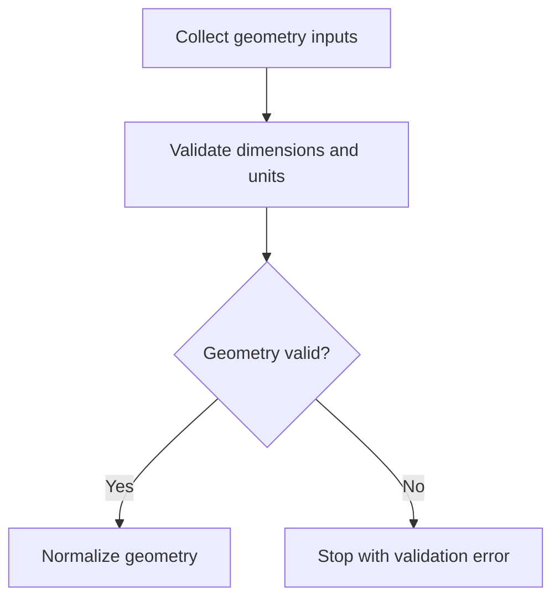
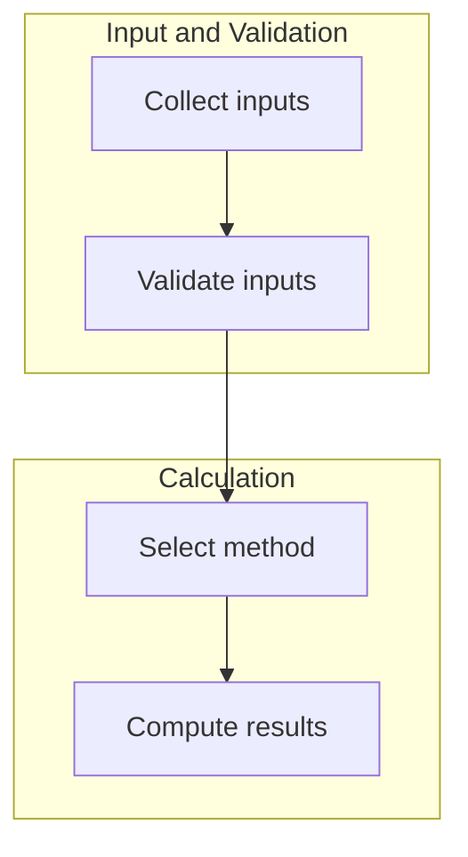

# Engineering Calculation Logic Architecture

Use this skill before implementing engineering calculation software.

This skill converts engineering reference materials into a structured, traceable, implementation-ready calculation logic architecture. It is a bridge between unstructured references and downstream reusable calculation-book software.

This skill does **not** primarily write production code. It prepares the calculation blueprint that a later implementation skill can use to build typed models, calculation modules, runners, reports, review UIs, batch workflows, and tests.

## Core Principle

Do not treat Mermaid as the final product.

Mermaid diagrams are views of a deeper calculation logic model.

The required transformation is:

```text
reference materials
-> source inventory
-> engineering concept map
-> normalized calculation logic
-> traceable calculation blueprint
-> Mermaid views
-> software module mapping
-> verification plan
-> implementation handoff package
```

The core deliverable is a **Calculation Logic Blueprint**. Mermaid is one of its standard visual outputs.

## When to Use

Use this skill when the user provides or describes:

```text
engineering standards or codes
design manuals
calculation PDFs
Excel workbooks or spreadsheets
hand calculations
historical project calculation reports
technical specifications
test reports
soil investigation reports
existing calculation scripts
mixed references for one calculation workflow
```

Use it for engineering calculation domains such as:

```text
geotechnical engineering
foundation engineering
retaining structures
pile design
bridge substructures
structural design
hydraulic calculations
drainage design
pavement engineering
temporary works
construction-stage checks
other formal engineering calculation systems
```

## Non-Goals

Do not jump directly to final implementation unless explicitly requested.

This skill should not primarily produce:

```text
full production code
final report renderer
frontend application
database schema
batch execution system
complete calculation software package
```

Those belong to a downstream implementation skill.

This skill may provide pseudocode, function boundaries, model names, and module mapping when useful, but production code is not the main deliverable.

## Architecture Layers

Analyze references through these layers.

| Layer | Purpose | Typical Output |
| --- | --- | --- |
| Reference layer | Identify source documents, versions, priority, authority, and scope | source inventory |
| Concept layer | Extract engineering objects, checks, design methods, limit states, conditions, and assumptions | engineering concept map |
| Logic layer | Convert engineering logic into normalized calculation nodes | calculation blueprint |
| Diagram layer | Generate Mermaid views from the calculation blueprint | global flowchart, data flow, branch diagram, module diagram |
| Software mapping layer | Map logic nodes to input models, functions, reusable modules, book runner steps, result objects, and report sections | implementation guidance |
| Verification layer | Identify tests, reference examples, regression targets, edge cases, and risks | verification plan |
| Handoff layer | Package the analysis for downstream engineering calculation software implementation | implementation handoff package |

## Source Inventory Contract

Assign a stable source ID to every reference.

Use IDs such as:

```text
S01, S02, S03
CODE-01
EXCEL-01
REPORT-01
NOTE-01
```

For each source, record:

```text
source_id
source_name
source_type
version_or_date
jurisdiction_or_project if applicable
role_in_analysis
priority
authority_level
reliability_notes
scope_of_applicability
known_limitations
```

Recommended source table:

| Source ID | Source | Type | Version/Date | Role | Priority | Notes |
| --- | --- | --- | --- | --- | --- | --- |

## Source Authority Hierarchy

When multiple sources exist, classify authority rather than treating all references equally.

Default priority order:

```text
1. project-specific contractual requirement
2. governing design code or standard
3. official code commentary or nationally recognized design manual
4. project-approved calculation basis
5. published worked example from reliable source
6. verified historical calculation report
7. legacy spreadsheet
8. internal design note
9. engineering assumption
10. unknown source or unverified material
```

If the user specifies a different authority order, follow the user's order.

When sources conflict, do not silently choose one. Record:

```text
conflict_id
affected formula, coefficient, branch, or assumption
source A method
source B method
engineering consequence
recommended resolution or confirmation
```

## Engineering Concept Layer

Before extracting formulas, identify the engineering concepts.

Typical concepts include:

```text
calculation object
design situation
limit state
load case
load combination
material model
soil model
water or environmental condition
geometry model
boundary condition
design method
checking method
safety format
failure mode
serviceability criterion
ultimate criterion
special condition
governing result
report output
```

Required concept table:

| Concept | Meaning | Role in calculation | Source | Notes |
| --- | --- | --- | --- | --- |

The concept layer prevents the output from becoming a raw list of formulas without engineering structure.

## Normalized Calculation Node Model

Represent each meaningful calculation step as a node.

Each node should include as many of these fields as practical:

```text
node_id
node_type
node_name
engineering_meaning
inputs
outputs
units
formula_or_method
source_reference
branch_condition
applicability
assumptions
module_candidate
result_visibility
report_visibility
test_requirement
risk_level
```

Allowed node types:

```text
Input
Validate
Normalize
SelectMethod
Lookup
Compute
Branch
Check
Aggregate
Output
Report
Warning
Error
Redesign
```

### Node Type Semantics

| Node Type | Meaning | Software Mapping |
| --- | --- | --- |
| Input | User, file, project, database, or reference-supplied data | input model field |
| Validate | Required value, range, relationship, unit, or applicability check | validator |
| Normalize | Unit conversion, sign convention normalization, data cleaning | preprocessing function |
| SelectMethod | Choose design method, formula set, code path, or strategy | options model / strategy selector |
| Lookup | Table lookup, chart extraction, parameter library, interpolation | reusable lookup library |
| Compute | Formula or algorithmic calculation | reusable calculation function |
| Branch | Logical decision that changes the calculation path | if/else / strategy pattern |
| Check | Pass/fail, utilization, demand-capacity, limit check | CheckResult |
| Aggregate | Governing value selection, envelope, summary | governing summary |
| Output | Structured result field | result model field |
| Report | Report-only organization of already computed results | report context |
| Warning | Non-fatal issue or engineering caution | warning object |
| Error | Fatal invalid input or impossible condition | validation error / calculation error |
| Redesign | Suggested redesign action after failed check | recommendation / diagnostic output |

## Calculation Logic Blueprint

The Calculation Logic Blueprint is the main artifact.

It is a structured representation of the calculation workflow that is richer than a flowchart and more implementation-ready than prose.

A blueprint should answer:

```text
What is calculated?
Why is it calculated?
What inputs are required?
What intermediate values are produced?
What formulas or methods are used?
What branch conditions exist?
What outputs and checks are produced?
What sources justify each major step?
What nodes can become reusable software modules?
What must be tested?
What remains uncertain?
```

Recommended blueprint table:

| Node ID | Type | Name | Inputs | Outputs | Source | Module Candidate | Test Need |
| --- | --- | --- | --- | --- | --- | --- | --- |

For complex systems, organize nodes by stage:

```text
input collection
input validation
normalization
method selection
core calculation
special-condition handling
checking and utilization
governing summary
report output
redesign diagnostics
```

## Required Workflow

When analyzing reference materials, proceed in this order:

1. Identify the calculation purpose and engineering domain.
2. Identify source materials and their authority.
3. Build a source inventory with stable source IDs.
4. Extract engineering objects, design situations, checks, methods, and assumptions.
5. Identify input groups, output groups, and important intermediate values.
6. Extract formulas, methods, lookup tables, empirical rules, and stated limits of applicability.
7. Identify method-selection logic, branch conditions, special cases, and not-applicable conditions.
8. Normalize the sequence into calculation nodes.
9. Identify reusable calculation modules and book-specific orchestration logic.
10. Generate Mermaid views from the normalized logic.
11. Map the logic to future software components.
12. Identify tests, edge cases, regression references, and verification risks.
13. List open questions, ambiguity, missing information, and assumptions requiring confirmation.
14. Produce an implementation handoff package.

## Required Output Modes

Select the output depth according to the user's task.

### Lightweight Mode

Use when the user asks for a quick structure, outline, or early draft.

Provide:

```text
scope and purpose
main logic summary
Mermaid global flowchart
key inputs and outputs
major branch conditions
module candidates
open questions
```

### Standard Mode

Use for normal reference-to-logic tasks.

Provide:

```text
scope and purpose
source summary
engineering concept map
calculation logic summary
normalized calculation node inventory
Mermaid global flowchart
input inventory
output inventory
branch inventory
software module mapping
verification plan
open questions
handoff summary
```

### Full Architecture Mode

Use when the user provides many references or wants downstream implementation guidance.

Provide all required sections in this skill, including multiple Mermaid views, formula inventory, intermediate value inventory, traceability, verification plan, and implementation handoff package.

## Required Output Structure

For substantial tasks, use the following structure.

### 1. Scope and Purpose

State:

```text
engineering domain
calculation object
calculation purpose
main checks
main outputs
intended downstream use
```

### 2. Source Summary

Summarize available sources.

| Source ID | Source | Type | Version/Date | Role | Priority | Notes |
| --- | --- | --- | --- | --- | --- | --- |

If source material was not provided, state that the flow is based only on user-provided description and mark relevant items as `needs confirmation`.

### 3. Engineering Concept Map

Identify the main engineering concepts.

| Concept | Meaning | Role in calculation | Source | Notes |
| --- | --- | --- | --- | --- |

### 4. Calculation Logic Summary

Explain the workflow in plain language before diagrams.

Use an implementation-oriented pattern:

```text
input
-> validation
-> normalization
-> method selection
-> calculation
-> special-condition handling
-> check
-> governing summary
-> output
```

### 5. Normalized Calculation Node Inventory

Provide a table:

| Node ID | Type | Name | Inputs | Outputs | Source | Module Candidate |
| --- | --- | --- | --- | --- | --- | --- |

Node IDs should be stable and descriptive, for example:

```text
N001_collect_geometry
N010_validate_loads
N020_select_method
N030_compute_core_capacity
N040_check_utilization
N050_build_summary
```

### 6. Mermaid Global Flowchart

Provide one global calculation flowchart.

Use:

```text
flowchart TD
```

The chart should show:

```text
input groups
validation
calculation stages
branch decisions
special cases
checks
final outputs
```

### 7. Mermaid Data Flow Diagram

Provide a data-oriented diagram when useful.

It should show data moving through:

```text
raw input
-> normalized input
-> intermediate values
-> module results
-> governing summary
-> report context
```

Use this diagram especially when the downstream task will create typed models or JSON schemas.

### 8. Mermaid Branch Logic Diagram

Provide a branch-focused diagram when method selection is important.

It should show:

```text
design method choices
material condition choices
boundary condition choices
special-case triggers
error paths
not-applicable paths
```

### 9. Mermaid Module Dependency Diagram

Provide a programming-oriented module dependency diagram.

It should show likely software components and dependencies, such as:

```text
book runner
-> reusable calculation modules
-> result summary
-> report context
```

This diagram should align with the downstream engineering calculation book architecture.

### 10. Input Inventory

Provide a table:

| Field | Symbol | Unit | Source | Required? | Default? | Validation Rule | Module |
| --- | --- | --- | --- | --- | --- | --- | --- |

Group inputs when possible:

```text
project information
geometry
loads
materials
soil
water
environment
design options
code options
special-case flags
```

Classify each input source:

```text
user input
project input
source document
lookup table
spreadsheet input
engineering assumption
unknown / needs confirmation
```

### 11. Intermediate Value Inventory

Provide a table:

| Value | Symbol | Unit | Derived From | Used By | Should Be Reported? |
| --- | --- | --- | --- | --- | --- |

Intermediate values should include values that are important for:

```text
auditability
engineering review
report tables
debugging
regression tests
governing-case explanation
```

### 12. Output and Result Inventory

Provide a table:

| Output | Symbol | Unit | Meaning | Status Logic | Report Section |
| --- | --- | --- | --- | --- | --- |

Distinguish:

```text
computed values
design values
check results
governing results
warnings
errors
not-applicable results
redesign recommendations
```

### 13. Formula and Method Inventory

Provide a table:

| Formula/Method | Inputs | Outputs | Source | Applicability | Notes |
| --- | --- | --- | --- | --- | --- |

Classify formulas and methods as:

```text
code-defined
manual-defined
spreadsheet-derived
empirical
project-specific
engineering assumption
needs confirmation
```

Do not silently invent missing formulas. Mark uncertain formulas as `needs confirmation`.

### 14. Lookup Table and Chart Inventory

If references include tables, charts, graphs, nomograms, or coefficients, provide:

| Lookup Item | Inputs | Outputs | Source | Interpolation Rule | Implementation Note |
| --- | --- | --- | --- | --- | --- |

Identify whether the lookup requires:

```text
exact lookup
linear interpolation
bilinear interpolation
chart digitization
nearest conservative value
engineering judgment
manual selection
```

### 15. Decision and Branch Inventory

Provide a table:

| Condition | Meaning | Path If True | Path If False | Program Impact |
| --- | --- | --- | --- | --- |

Common branch categories:

```text
method selection
code selection
limit-state selection
drained vs undrained
short-term vs long-term
load present vs absent
water condition
geometry validity
material class
soil layer condition
special condition present vs absent
standard method vs project-specific method
valid vs not applicable
```

### 16. Assumption and Applicability Inventory

Provide a table:

| Assumption or Limit | Applies To | Source | Program Handling | Risk |
| --- | --- | --- | --- | --- |

Program handling may be:

```text
validator
warning
hard error
option flag
report note
manual confirmation
```

### 17. Software Module Mapping

Map calculation logic to future software modules.

| Proposed Module | Responsibility | Inputs | Outputs | Reusable? | Suggested Layer |
| --- | --- | --- | --- | --- | --- |

Suggested layers:

```text
core
libraries
books
report
review/frontend
batch
```

Use these classifications:

```text
general reusable engineering logic
domain-specific reusable logic
calculation-book-specific orchestration
project-specific override
manual engineering judgment
presentation-only logic
```

### 18. Suggested Data Models

Recommend future typed models. Provide model names and field groups, not full production code unless requested.

Examples:

```text
ProjectInfo
DesignOptions
GeometryInput
LoadInput
MaterialInput
SoilProfileInput
WaterConditionInput
CalculationInput
MethodOptions
ModuleResult
CheckResult
GoverningSummary
BookResult
ReportContext
```

For each model, identify:

```text
purpose
key fields
source
used by
result relationship
```

### 19. Validation Rules

List validation rules needed before calculation.

| Rule ID | Validation Rule | Severity | Related Inputs | Handling |
| --- | --- | --- | --- | --- |

Severity options:

```text
error
warning
info
needs confirmation
```

Validation should cover:

```text
required values
units
numeric ranges
sign conventions
relationships between fields
method applicability
lookup table bounds
not-applicable conditions
impossible geometry or loads
missing source assumptions
```

### 20. Verification Plan

Identify what must be tested later.

| Test Target | Test Type | Reference Basis | Priority | Notes |
| --- | --- | --- | --- | --- |

Test types may include:

```text
unit test
branch test
edge case test
regression test
integration test
lookup test
report smoke test
```

Reference bases may include:

```text
code example
manual example
textbook example
spreadsheet comparison
historical project
independent hand calculation
approved report
```

### 21. Risk Register

For engineering or implementation risks, provide:

| Risk ID | Risk | Cause | Impact | Mitigation |
| --- | --- | --- | --- | --- |

Common risks:

```text
formula conflict
unit ambiguity
hidden spreadsheet formula
manual coefficient selection
unclear design method
incomplete branch rule
ambiguous safety factor
unverified empirical method
out-of-range lookup
missing load combination logic
```

### 22. Ambiguities and Open Questions

Always list:

```text
missing formulas
unclear units
conflicting source methods
hidden spreadsheet assumptions
unclear branch rules
unclear safety factors
unclear applicability limits
values that appear to be engineering judgment
items requiring user confirmation
```

Do not hide uncertainty.

### 23. Implementation Handoff Package

End with a concise handoff summary for the downstream implementation skill.

Include:

```text
recommended reusable modules
recommended book-specific runner sequence
recommended input model groups
recommended result model groups
recommended report sections
recommended tests
highest-risk assumptions
items needing confirmation before coding
```

## Mermaid Rules

Mermaid diagrams must be implementation-oriented.

Use consistent node meanings:

```text
input node: data provided by user, file, database, or source document
validation node: check before calculation
normalization node: unit conversion or standardization
decision node: branch condition
compute node: formula or method
lookup node: table or library lookup
check node: pass/fail, utilization, or demand-capacity check
aggregate node: governing summary
output node: result or report data
error node: invalid or not-applicable path
redesign node: diagnostic action after failed check
```

Rules:

```text
prefer multiple focused diagrams over one overloaded diagram
keep node labels concise
include symbols only when useful
show formulas only when they clarify the logic
show branch conditions explicitly
show failure paths where they affect engineering decisions
show not-applicable paths where they affect software behavior
ensure each important node maps to a data model, function, validation rule, result field, or report section
```

## Recommended Mermaid Views

### Global Calculation Flowchart

Purpose:

```text
show the overall engineering calculation sequence
```

Use when:

```text
every substantial task
```

Recommended syntax:

```text
flowchart TD
```

### Data Flow Diagram

Purpose:

```text
show how raw inputs become normalized inputs, intermediate values, results, and report context
```

Use when:

```text
downstream implementation will require typed input or JSON models
```

### Branch Logic Diagram

Purpose:

```text
show method selection, applicability rules, special cases, and failure paths
```

Use when:

```text
there are multiple design methods, soil conditions, load paths, code options, or special cases
```

### Module Dependency Diagram

Purpose:

```text
show likely software modules and their dependency direction
```

Use when:

```text
the output will feed a programming or calculation-book implementation skill
```

### Report Section Diagram

Purpose:

```text
show how results should appear in a formal calculation report
```

Use when:

```text
the user is preparing report-generation software or formal calculation books
```

## Mermaid Syntax Guidance

Use readable labels.

Good:



Avoid overloaded labels with too many equations, paragraphs, or source notes.

If a formula is long, put the formula in the formula inventory and keep the Mermaid label short.

Use `subgraph` for major stages:



## Input Extraction Rules

Always separate input groups.

Default input groups:

```text
project information
calculation case identifiers
geometry
loads and load combinations
materials
soil and ground model
water and environmental conditions
construction or stage conditions
design method options
code or standard options
safety factors or partial factors
special-case flags
user assumptions
```

For every input, identify:

```text
field name
engineering symbol
unit
source
required or optional
default value if any
validation rule
used by which node or module
```

## Unit and Sign Convention Rules

Always look for unit and sign convention issues.

Record:

```text
input units
internal calculation units if implied
output units
angle units
force sign convention
moment sign convention
coordinate directions
load direction conventions
pressure/stress conventions
settlement or displacement sign conventions
```

If units or signs are unclear, mark as `needs confirmation`.

Do not assume unit conversion rules silently when references are inconsistent.

## Formula Extraction Rules

For each important formula or method, identify:

```text
name
purpose
inputs
outputs
units
source reference
applicability
special cases
required coefficients
lookup dependencies
expected intermediate values
```

Do not reproduce every minor algebraic expression if it harms clarity.

Prioritize formulas that define:

```text
method selection
capacity or resistance
load effect or demand
utilization or pass/fail
special-case correction
governing value selection
report-critical intermediate values
```

## Lookup and Interpolation Rules

When references contain tables or charts, identify implementation requirements.

Classify lookup behavior:

```text
exact key lookup
range lookup
linear interpolation
bilinear interpolation
log interpolation
nearest conservative value
chart digitization
manual selection
not specified / needs confirmation
```

For charts and nomograms, record whether data must be digitized or approximated.

For tables with out-of-range values, identify expected behavior:

```text
error
warning
cap to boundary
extrapolate
manual confirmation
not specified
```

## Branch and Applicability Rules

Branch logic must be explicit.

For every important branch, identify:

```text
condition
engineering meaning
source
true path
false path
not-applicable behavior
program representation
required tests
```

Typical branch types:

```text
method selection branch
material model branch
soil condition branch
water condition branch
load existence branch
geometry validity branch
code option branch
limit-state branch
special-case branch
failure or redesign branch
```

## Output and Result Rules

Outputs should be classified as:

```text
computed intermediate value
module result
check result
governing result
status
warning
error
recommendation
report table value
```

For each check result, identify expected status semantics:

```text
OK / PASS
NG / FAIL
WARNING
ERROR
NOT_APPLICABLE
NEEDS_CONFIRMATION
```

For demand-capacity checks, identify:

```text
demand
capacity
utilization or safety factor
allowable limit
status rule
report wording
```

## Software Mapping Rules

Map logic to software without over-implementing.

Use this dependency direction:

```text
presentation / report / review / batch / API
  -> books
    -> libraries
      -> core
```

Classify every proposed software component into:

```text
core platform
reusable engineering library
calculation book runner
report context or renderer
review or frontend
batch process
```

Do not place engineering formulas in:

```text
frontend
review UI
report templates
batch scripts
CSV or spreadsheet input files
presentation-only code
```

Identify likely reusable modules, such as:

```text
unit conversion
input validation
load combinations
geometry processing
soil profile processing
material properties
lookup tables
formula libraries
check result utilities
governing summary utilities
report context builders
```

## Suggested Function Boundary Rules

When proposing functions, prefer stable engineering boundaries.

Good function candidates:

```text
compute_effective_geometry(...)
select_design_method(...)
lookup_coefficient(...)
compute_capacity(...)
compute_demand(...)
check_utilization(...)
summarize_governing_results(...)
build_report_context(...)
```

Avoid functions that mix concerns:

```text
read_excel_and_compute_and_render_report(...)
frontend_button_calculate_capacity(...)
template_calculate_result(...)
batch_runner_with_own_formula_logic(...)
```

## Verification Rules

Verification must be designed from the extracted logic.

For each major formula, branch, lookup, and check, identify at least one appropriate test target when practical.

Prioritize reference bases:

```text
governing code worked example
published design manual example
verified textbook example
approved historical report
legacy spreadsheet with known expected values
independent hand calculation
synthetic edge case
```

Test categories:

```text
unit tests for isolated formulas
lookup tests for tables and interpolation
branch tests for method selection
edge case tests for boundary conditions
regression tests against references
integration tests for complete calculation workflows
report smoke tests for presentation output
```

## Ambiguity Handling Rules

Never hide ambiguity.

If materials are incomplete or inconsistent, explicitly mark:

```text
unknown
not provided
inferred
assumed
needs confirmation
conflict found
```

For each ambiguity, state:

```text
what is unclear
why it matters
which downstream module is affected
recommended confirmation or conservative handling
```

Do not invent missing safety factors, formulas, units, coefficients, or applicability limits.

## Generalization Rules

Do not overfit the output to one example, project, spreadsheet, or report.

When extracting logic, ask:

```text
Is this reusable across projects?
Is this specific to this calculation book?
Is this a design option?
Is this a source-specific convention?
Is this a temporary project assumption?
Is this manual engineering judgment?
```

Classify each important rule as:

```text
general reusable engineering logic
domain-specific reusable logic
calculation-book-specific logic
project-specific override
manual engineering judgment
presentation-only logic
unknown / needs confirmation
```

## Handoff to Downstream Implementation Skill

The output of this skill should be suitable input for a downstream engineering calculation book implementation skill.

The downstream skill should be able to create:

```text
typed input models
validation rules
calculation modules
book runner
result models
governing summary
report context
review UI
batch runner
tests
```

The handoff package should be concise but complete enough to guide implementation.

Recommended handoff format:

```text
Calculation scope:
Source basis:
Reusable module candidates:
Book-specific runner sequence:
Input model groups:
Result model groups:
Report sections:
Validation rules:
Formula and lookup risks:
Test requirements:
Open questions before coding:
```

## Quality Checklist

Before finalizing the analysis, verify:

```text
calculation purpose is clear
source materials are summarized with stable IDs
source authority and conflicts are identified
major engineering concepts are extracted
major inputs are identified
major outputs are identified
important intermediate values are identified
branch logic is explicit
formula sources are tracked where possible
lookup and interpolation behavior is identified
applicability limits are identified
Mermaid diagrams are implementation-oriented
module candidates are proposed
data model groups are suggested
validation rules are listed
verification requirements are listed
risks and ambiguities are not hidden
handoff package is complete
```

## Required Final Answer for Analysis Tasks

When responding to a user request that asks to analyze references and extract a calculation architecture, provide the following by default:

```text
1. Scope and purpose
2. Source summary
3. Engineering concept map
4. Calculation logic summary
5. Normalized calculation node inventory
6. Mermaid global flowchart
7. Mermaid data flow diagram when useful
8. Mermaid branch logic diagram when useful
9. Mermaid module dependency diagram when useful
10. Input inventory
11. Intermediate value inventory
12. Output and result inventory
13. Formula and method inventory
14. Decision and branch inventory
15. Software module mapping
16. Suggested data models
17. Validation rules
18. Verification plan
19. Risks, ambiguities, and open questions
20. Implementation handoff package
```

For small tasks, a shorter version is acceptable, but it must still preserve:

```text
logic clarity
source traceability
branch visibility
module mapping
implementation usefulness
```

## Final Principle

This skill turns engineering references into a reusable calculation logic architecture.

The goal is not merely to draw a flowchart.

The goal is to produce a traceable, reviewable, implementation-ready blueprint that makes later engineering calculation software development safer, clearer, and more reusable.
